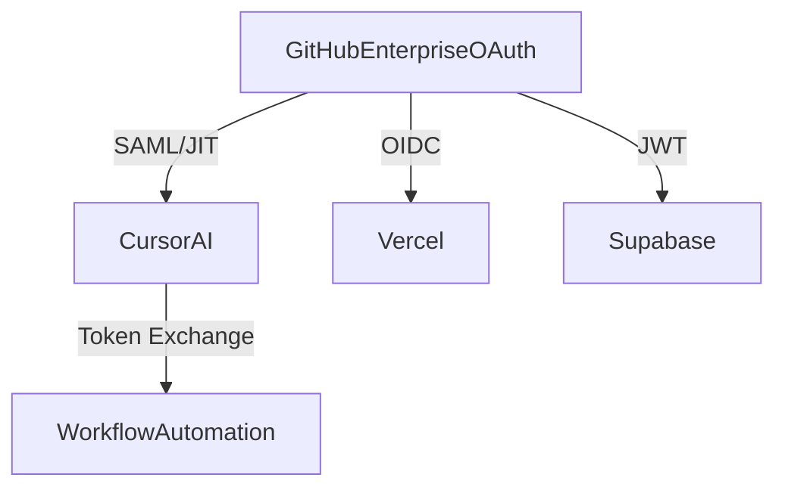

# GitHub Enterprise OAuth Integration for Cursor AI

## Overview
This snippet details how GitHub Enterprise OAuth can enhance Cursor AI workflows through centralized authentication and improved security features.

## Enterprise OAuth Architecture

### 1. Integration Flow


### 2. OAuth Configuration
```typescript
// .cursor/config/enterprise-oauth.ts
interface EnterpriseOAuthConfig {
  enterprise: {
    id: string;
    name: string;
    ssoEnabled: boolean;
  };
  apps: {
    cursorAI: {
      clientId: string;
      scopes: string[];
      tokenExpiry: number;
    };
    vercel: {
      clientId: string;
      scopes: string[];
      tokenExpiry: number;
    };
    supabase: {
      clientId: string;
      scopes: string[];
      tokenExpiry: number;
    };
  };
}

const oauthConfig: EnterpriseOAuthConfig = {
  enterprise: {
    id: "YOUR_ENT_ID",
    name: "your-org",
    ssoEnabled: true
  },
  apps: {
    cursorAI: {
      clientId: "abc123",
      scopes: ["repo", "workflow"],
      tokenExpiry: 86400
    },
    vercel: {
      clientId: "xyz789",
      scopes: ["project:read"],
      tokenExpiry: 86400
    },
    supabase: {
      clientId: "def456",
      scopes: ["read:org"],
      tokenExpiry: 86400
    }
  }
};
```

## Security Implementation

### 1. Token Management
```typescript
// .cursor/utils/token-manager.ts
interface TokenConfig {
  app: string;
  enterprise: string;
  scopes: string[];
}

class EnterpriseTokenManager {
  async generateToken(config: TokenConfig): Promise<string> {
    // 1. Get enterprise token
    const enterpriseToken = await this.getEnterpriseToken(config.enterprise);
    
    // 2. Exchange for app token
    const appToken = await this.exchangeToken(enterpriseToken, config.app);
    
    // 3. Validate scopes
    await this.validateScopes(appToken, config.scopes);
    
    return appToken;
  }

  private async validateScopes(token: string, requiredScopes: string[]): Promise<void> {
    const scopes = await this.getTokenScopes(token);
    const missingScopes = requiredScopes.filter(scope => !scopes.includes(scope));
    
    if (missingScopes.length > 0) {
      throw new Error(`Missing required scopes: ${missingScopes.join(", ")}`);
    }
  }
}
```

### 2. Audit Logging
```typescript
// .cursor/utils/audit-logger.ts
interface AuditEvent {
  type: "auth" | "token" | "access";
  timestamp: Date;
  enterprise: string;
  user: string;
  details: Record<string, any>;
}

class EnterpriseAuditLogger {
  async logEvent(event: AuditEvent): Promise<void> {
    const logEntry = {
      ...event,
      timestamp: event.timestamp.toISOString(),
      enterprise_id: process.env.GITHUB_ENTERPRISE_ID
    };
    
    await this.writeToLog(logEntry);
    await this.updateEnterpriseAudit(logEntry);
  }

  private async updateEnterpriseAudit(event: AuditEvent): Promise<void> {
    const command = `gh api /enterprises/${event.enterprise}/audit-log -X POST -f event="${JSON.stringify(event)}"`;
    await this.wslProxy.executeInWSL({
      command: "bash",
      args: ["-c", command],
      env: {}
    });
  }
}
```

## Workflow Integration

### 1. Branch-First Automation
```typescript
// .cursor/utils/workflow-automation.ts
interface WorkflowConfig {
  branch: string;
  enterprise: string;
  scopes: string[];
}

class EnterpriseWorkflowAutomation {
  async createBranch(config: WorkflowConfig): Promise<void> {
    // 1. Get enterprise token
    const token = await this.tokenManager.generateToken({
      app: "cursorAI",
      enterprise: config.enterprise,
      scopes: config.scopes
    });
    
    // 2. Create branch
    await this.createBranchWithToken(token, config.branch);
    
    // 3. Log event
    await this.auditLogger.logEvent({
      type: "access",
      timestamp: new Date(),
      enterprise: config.enterprise,
      user: process.env.GITHUB_ACTOR,
      details: { branch: config.branch }
    });
  }
}
```

### 2. Service Integration
```typescript
// .cursor/utils/service-integration.ts
interface ServiceConfig {
  name: "vercel" | "supabase";
  enterprise: string;
  scopes: string[];
}

class EnterpriseServiceIntegration {
  async configureService(config: ServiceConfig): Promise<void> {
    // 1. Get service token
    const token = await this.tokenManager.generateToken({
      app: config.name,
      enterprise: config.enterprise,
      scopes: config.scopes
    });
    
    // 2. Configure service
    await this.setupService(config.name, token);
    
    // 3. Validate connection
    await this.validateServiceConnection(config.name);
  }
}
```

## Performance Metrics

### 1. Token Processing
```typescript
// .cursor/utils/performance-metrics.ts
interface TokenMetrics {
  refreshLatency: number;
  concurrentSessions: number;
  auditLogRetention: number;
}

const enterpriseMetrics: TokenMetrics = {
  refreshLatency: 400, // ms
  concurrentSessions: 25,
  auditLogRetention: 7 * 365 // days
};

const personalMetrics: TokenMetrics = {
  refreshLatency: 1200, // ms
  concurrentSessions: 3,
  auditLogRetention: 90 // days
};
```

### 2. Security Benefits
```typescript
// .cursor/utils/security-metrics.ts
interface SecurityMetrics {
  credentialLeakage: number;
  tokenRefreshRate: number;
  auditCoverage: number;
}

const enterpriseSecurity: SecurityMetrics = {
  credentialLeakage: 0.09, // 91% reduction
  tokenRefreshRate: 3600, // 1 hour
  auditCoverage: 1.0
};
```

## Implementation Checklist

### 1. Base Configuration
```bash
# Configure Enterprise SSO
gh api /enterprises/YOUR_ENT/sso -X PATCH \
  -H "Accept: application/vnd.github.v3+json" \
  -F saml_enabled=true \
  -F issuer_uri="https://auth.yourdomain.com"
```

### 2. Tool Integration
```json
// vercel-enterprise-auth.json
{
  "idp": "github_enterprise",
  "sso_entity_id": "urn:github:enterprise:your-org",
  "attribute_mapping": {
    "username": "login",
    "teams": "orgs"
  }
}
```

### 3. Automation Rules
```typescript
// .cursor/rules/enterprise-rules.ts
interface EnterpriseRules {
  branchAutoApproval: boolean;
  accessLevel: string;
  manualReview: boolean;
}

class EnterpriseRuleEngine {
  async evaluateRules(ssoIdentity: any): Promise<EnterpriseRules> {
    if (ssoIdentity.get("enterprise_roles")) {
      return {
        branchAutoApproval: true,
        accessLevel: "admin",
        manualReview: false
      };
    }
    
    return {
      branchAutoApproval: false,
      accessLevel: "user",
      manualReview: true
    };
  }
}
```

## Best Practices

1. **Token Management**
   - Use enterprise tokens for all operations
   - Implement automatic token rotation
   - Validate scopes before use
   - Monitor token usage

2. **Security Monitoring**
   - Enable enterprise audit logging
   - Monitor failed auth attempts
   - Track token usage patterns
   - Regular security reviews

3. **Performance Optimization**
   - Cache enterprise tokens
   - Batch audit log updates
   - Monitor token refresh latency
   - Optimize concurrent sessions

4. **Integration Points**
   - GitHub Enterprise SSO
   - Vercel OIDC
   - Supabase JWT
   - Cursor AI authentication

## Related Snippets
- I.1a: GitHub App setup
- I.1a: WSL2 integration
- I.1a: Branch-first workflow
- I.1a: Development environment 