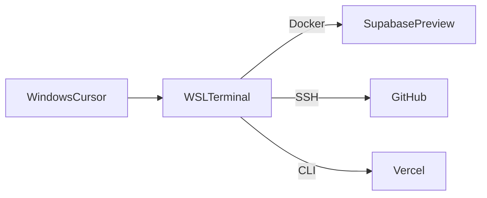

# WSL2 Integration with Cursor AI for GitOps

## Overview
This snippet details how Cursor AI agent leverages WSL2 for GitOps automation, including GitHub App setup, authentication, and security considerations for branch-first workflows.

## WSL2 Integration Architecture

### 1. Environment Bridging


### 2. Path Translation
```typescript
// .cursor/utils/path-manager.ts
interface PathConfig {
  windows: string;
  wsl: string;
  type: "code" | "data" | "config";
}

class PathManager {
  private pathMappings: Record<string, string> = {
    "C:\\Users\\": "/mnt/c/Users/",
    "~\\": "/home/<WSL_USERNAME>/"
  };

  translatePath(path: string): string {
    for (const [windows, wsl] of Object.entries(this.pathMappings)) {
      if (path.startsWith(windows)) {
        return path.replace(windows, wsl);
      }
    }
    return path;
  }
}
```

### 3. Terminal Proxy
```typescript
// .cursor/utils/wsl-proxy.ts
interface WSLCommand {
  command: string;
  args: string[];
  env: Record<string, string>;
}

class WSLProxy {
  async executeInWSL(config: WSLCommand): Promise<CommandResult> {
    const wslCommand = `wsl ${config.command} ${config.args.join(" ")}`;
    return await exec(wslCommand, { env: config.env });
  }
}
```

## GitHub App Integration

### 1. App Configuration
```json
// .cursor/github-app.json
{
  "app_id": "12345",
  "installation_id": "67890",
  "pem_path": "C:\\secrets\\app-private-key.pem",
  "scopes": ["repo", "workflow"],
  "permissions": {
    "contents": "read",
    "pull_requests": "write",
    "workflows": "write"
  }
}
```

### 2. Token Management
```typescript
// .cursor/utils/token-manager.ts
interface TokenConfig {
  appId: string;
  pemPath: string;
  installationId: string;
}

class TokenManager {
  async generateToken(config: TokenConfig): Promise<string> {
    const pem = await this.readPEM(config.pemPath);
    const token = await this.createJWT(config.appId, pem);
    return await this.getInstallationToken(token, config.installationId);
  }

  private async readPEM(path: string): Promise<string> {
    const wslPath = this.pathManager.translatePath(path);
    return await fs.readFile(wslPath, 'utf-8');
  }
}
```

## Security Implementation

### 1. Credential Storage
```typescript
// .cursor/utils/credential-manager.ts
interface CredentialConfig {
  provider: "wincred" | "wsl";
  key: string;
  value: string;
}

class CredentialManager {
  async storeCredential(config: CredentialConfig): Promise<void> {
    if (config.provider === "wincred") {
      await this.storeInWindowsCredentialManager(config);
    } else {
      await this.storeInWSL(config);
    }
  }

  private async storeInWindowsCredentialManager(config: CredentialConfig): Promise<void> {
    const command = `cmdkey /generic:${config.key} /user:token /pass:${config.value}`;
    await this.wslProxy.executeInWSL({
      command: "cmd.exe",
      args: ["/c", command],
      env: {}
    });
  }
}
```

### 2. Audit Trail
```typescript
// .cursor/utils/audit-manager.ts
interface AuditEvent {
  type: string;
  action: string;
  timestamp: Date;
  metadata: Record<string, any>;
}

class AuditManager {
  async logEvent(event: AuditEvent): Promise<void> {
    const logEntry = {
      ...event,
      timestamp: event.timestamp.toISOString(),
      cursor_version: process.env.CURSOR_VERSION
    };
    
    await this.writeToLog(logEntry);
    await this.updateGitHistory(logEntry);
  }

  private async updateGitHistory(event: AuditEvent): Promise<void> {
    const message = `[AI] ${event.type}: ${event.action}`;
    await exec(`git commit --allow-empty -m "${message}"`);
  }
}
```

## GitHub Actions Integration

### 1. Branch-First Workflow
```yaml
# .github/workflows/branch-first.yml
name: Branch Automation
on:
  create:
    branches: ['feat/**']

jobs:
  setup_environment:
    runs-on: ubuntu-latest
    steps:
      - name: Create Supabase preview
        uses: supabase/github-actions@v2
        with:
          command: preview-branch ${{ github.head_ref }}
          token: ${{ secrets.SUPABASE_TOKEN }}

      - name: Deploy Vercel
        uses: amondnet/vercel-action@v25
        with:
          vercel-token: ${{ secrets.VERCEL_TOKEN }}
          vercel-args: --prod

  ai_validation:
    runs-on: windows-latest
    container: cursorai/validator
    steps:
      - uses: cursorai/check@v3
        with:
          prompt: "Validate ${{ github.head_ref }} branch"
```

### 2. Token Rotation
```yaml
# .github/workflows/token-rotation.yml
name: Rotate Cursor AI Tokens
on:
  schedule:
    - cron: '0 0 * * *' # Daily at midnight

jobs:
  rotate:
    runs-on: windows-latest
    steps:
      - uses: cursorai/token-rotator@v2
        with:
          app_id: ${{ secrets.APP_ID }}
          pem: ${{ secrets.PEM }}
```