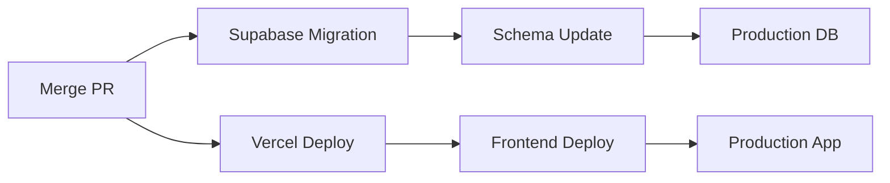

# Supabase Branch-First Workflow: Detailed Implementation

## Overview
This snippet provides a comprehensive guide to implementing the branch-first workflow for microSaaS development using Supabase and Vercel, including detailed steps, examples, and best practices.

## Prerequisites
- GitHub repository
- Supabase project
- Vercel project
- Supabase CLI
- Git CLI
- Node.js environment

## Installation Steps

### 1. Initialize Supabase Project
**IMPORTANT**: Supabase project MUST be created through Vercel's integration for proper branch-first workflow support. This ensures:
- Automatic preview branch creation
- Environment variable management
- Preview database provisioning
- Branch-specific database migrations

1. In Vercel project settings:
   - Navigate to Integrations
   - Select Supabase
   - Follow the setup wizard
   - Verify branch-first workflow is enabled

2. After Vercel integration is complete:
```bash
# Initialize Supabase
supabase init

# Link project
supabase link --project-ref your-project-ref

# Start local development
supabase start
```

### 2. Configure Git Workflow
```bash
# Set up Git hooks
npx husky install

# Add pre-commit hook
npx husky add .husky/pre-commit "supabase db diff --linked"
```

## Workflow Implementation

### 1. Git Branch Creation
```bash
# Create feature branch
git checkout -b feat-new-auth-flow

# Create migration directory
mkdir -p supabase/migrations/$(date +%Y%m%d%H%M%S)_auth_flow

# Create migration file
touch supabase/migrations/$(date +%Y%m%d%H%M%S)_auth_flow/up.sql
```

### 2. Database Changes
```sql
-- supabase/migrations/20240315000000_auth_flow/up.sql
-- Add new auth table
CREATE TABLE auth_flows (
  id UUID PRIMARY KEY DEFAULT uuid_generate_v4(),
  user_id UUID REFERENCES auth.users(id),
  flow_type TEXT NOT NULL,
  status TEXT NOT NULL,
  created_at TIMESTAMPTZ DEFAULT NOW(),
  updated_at TIMESTAMPTZ DEFAULT NOW()
);

-- Add RLS policies
ALTER TABLE auth_flows ENABLE ROW LEVEL SECURITY;

CREATE POLICY "Users can view their own flows"
  ON auth_flows FOR SELECT
  USING (auth.uid() = user_id);

CREATE POLICY "Users can create their own flows"
  ON auth_flows FOR INSERT
  WITH CHECK (auth.uid() = user_id);
```

### 3. Preview Branch Activation
```bash
# Push changes to trigger preview branch
git add .
git commit -m "feat: add new auth flow"
git push origin feat-new-auth-flow

# Verify preview branch creation
supabase branch list
```

### 4. Edge Function Development
```typescript
// supabase/functions/auth-flow/index.ts
import { serve } from 'https://deno.land/std@0.168.0/http/server.ts'
import { createClient } from 'https://esm.sh/@supabase/supabase-js@2'

serve(async (req) => {
  const supabase = createClient(
    Deno.env.get('SUPABASE_URL') ?? '',
    Deno.env.get('SUPABASE_ANON_KEY') ?? ''
  )

  const { data, error } = await supabase
    .from('auth_flows')
    .select('*')
    .limit(1)

  if (error) {
    return new Response(JSON.stringify({ error: error.message }), {
      status: 400,
      headers: { 'Content-Type': 'application/json' }
    })
  }

  return new Response(JSON.stringify({ data }), {
    headers: { 'Content-Type': 'application/json' }
  })
})
```

### 5. Migration Validation
```yaml
# .github/workflows/migration-check.yml
name: Migration Check
on:
  pull_request:
    types: [opened, synchronize]

jobs:
  validate:
    runs-on: ubuntu-latest
    steps:
      - uses: actions/checkout@v3
      - uses: supabase/setup-cli@v1
      - name: Validate Migrations
        run: |
          supabase db reset
          supabase db push
        env:
          SUPABASE_ACCESS_TOKEN: ${{ secrets.SUPABASE_ACCESS_TOKEN }}
```

### 6. Production Promotion


## Verification Steps

1. **Check Branch Status**
```bash
# Verify preview branch
supabase branch show feat-new-auth-flow

# Check database changes
supabase db diff --linked
```

2. **Test Edge Functions**
```bash
# Deploy edge function
supabase functions deploy auth-flow

# Test function
curl -X GET 'https://[branch-ref].supabase.co/functions/v1/auth-flow'
```

3. **Validate Migrations**
```bash
# Check migration status
supabase migration list

# Verify schema changes
supabase db dump
```

## Troubleshooting Tips

1. **Branch Creation Issues**
   - Check GitHub permissions
   - Verify Supabase project settings
   - Review error logs
   - Test manually

2. **Migration Problems**
   - Review SQL syntax
   - Check dependencies
   - Verify order
   - Test locally

3. **Edge Function Failures**
   - Check function logs
   - Verify environment variables
   - Test endpoints
   - Review permissions

## Common Issues and Solutions

1. **Migration Conflicts**
   - Review migration history
   - Check for duplicate changes
   - Verify dependencies
   - Test locally

2. **Edge Function Errors**
   - Check function logs
   - Verify environment variables
   - Test endpoints
   - Review permissions

3. **Preview Branch Issues**
   - Check project limits
   - Verify permissions
   - Review error logs
   - Clean up unused branches

## Best Practices

1. **Branch Management**
   - Use descriptive names
   - Keep branches up to date
   - Clean up unused branches
   - Document changes

2. **Migration Strategy**
   - Atomic changes
   - Clear naming
   - Version control
   - Testing

3. **Edge Functions**
   - Error handling
   - Logging
   - Security
   - Performance

## Related Snippets
- IV.4a: Supabase branch-first workflow
- IV.4a: Supabase environment isolation
- VI.6a: Vercel-Supabase integration
- VI.6b: GitHub Actions 