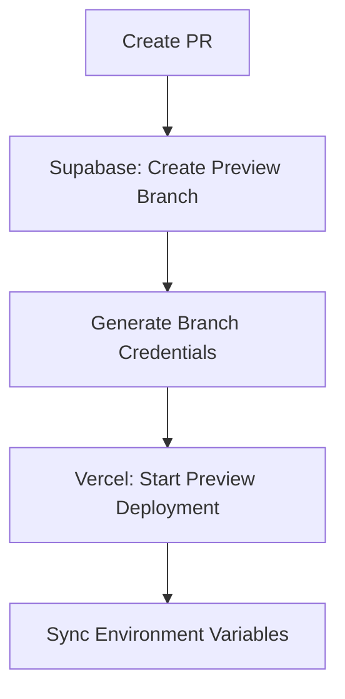

# Vercel-Supabase Integration

## Overview
This snippet details the integration between Vercel and Supabase, focusing on the branch-first workflow and preview environments.

## Prerequisites
- GitHub repository
- Vercel project (required for Supabase setup)
- Supabase project (created through Vercel integration)

## Setup Process

### 1. Initial Setup
**IMPORTANT**: Supabase MUST be set up through Vercel's integration for proper branch-first operations. This ensures:
- Automatic preview branch creation
- Environment variable management
- Preview database provisioning
- Branch-specific database migrations

1. In Vercel project settings:
   - Navigate to Integrations
   - Select Supabase
   - Follow the setup wizard
   - Verify branch-first workflow is enabled

2. After Vercel integration is complete, verify the following:
   - Supabase project is created
   - Environment variables are configured
   - Branch-first workflow is enabled
   - Preview environments are set up

## Installation Steps

### 1. Configure Vercel Integration
```bash
# Install Vercel CLI
npm i -g vercel

# Link Vercel project
vercel link

# Add Supabase integration
vercel integrations add supabase
```

### 2. Set Up GitHub Integration
```bash
# Configure GitHub integration
vercel git connect

# Verify integration status
vercel git status
```

## Configuration Details

### 1. Vercel Project Settings
```json
// vercel.json
{
  "buildCommand": "npm run build",
  "devCommand": "npm run dev",
  "installCommand": "npm install",
  "framework": "nextjs",
  "regions": ["iad1"],
  "env": {
    "NEXT_PUBLIC_SUPABASE_URL": "@supabase-url",
    "NEXT_PUBLIC_SUPABASE_ANON_KEY": "@supabase-anon-key",
    "SUPABASE_SERVICE_ROLE_KEY": "@supabase-service-role-key"
  }
}
```

### 2. GitHub Actions Workflow
```yaml
# .github/workflows/vercel-supabase-sync.yml
name: Vercel-Supabase Sync
on:
  pull_request:
    types: [opened, synchronize]

jobs:
  sync:
    runs-on: ubuntu-latest
    steps:
      - uses: actions/checkout@v3
      - uses: supabase/setup-cli@v1
      - name: Sync Environment Variables
        run: |
          # Get Supabase credentials
          SUPABASE_URL=$(supabase status --json | jq -r '.api.url')
          SUPABASE_ANON_KEY=$(supabase status --json | jq -r '.api.anon_key')
          
          # Update Vercel environment variables
          vercel env add NEXT_PUBLIC_SUPABASE_URL $SUPABASE_URL
          vercel env add NEXT_PUBLIC_SUPABASE_ANON_KEY $SUPABASE_ANON_KEY
        env:
          VERCEL_TOKEN: ${{ secrets.VERCEL_TOKEN }}
          SUPABASE_ACCESS_TOKEN: ${{ secrets.SUPABASE_ACCESS_TOKEN }}
```

### 3. Integration Verification
```typescript
// src/lib/vercel-supabase.ts
export async function verifyIntegration() {
  const supabaseUrl = process.env.NEXT_PUBLIC_SUPABASE_URL;
  const supabaseKey = process.env.NEXT_PUBLIC_SUPABASE_ANON_KEY;
  
  if (!supabaseUrl || !supabaseKey) {
    throw new Error('Missing Supabase environment variables');
  }
  
  // Test connection
  const { data, error } = await supabase
    .from('health_check')
    .select('*')
    .limit(1);
    
  if (error) {
    throw new Error(`Integration verification failed: ${error.message}`);
  }
  
  return true;
}
```

## Integration Workflow

### 1. PR Creation


### 2. Environment Synchronization
```typescript
// src/lib/env-sync.ts
interface EnvSync {
  branch: string;
  supabaseUrl: string;
  supabaseKey: string;
  vercelUrl: string;
}

export async function syncEnvironments(config: EnvSync) {
  // 1. Verify Supabase branch
  const supabaseStatus = await verifySupabaseBranch(config.branch);
  
  // 2. Update Vercel environment
  await updateVercelEnv({
    NEXT_PUBLIC_SUPABASE_URL: config.supabaseUrl,
    NEXT_PUBLIC_SUPABASE_ANON_KEY: config.supabaseKey
  });
  
  // 3. Verify synchronization
  await verifyIntegration();
}
```

## Verification Steps

1. **Check Integration Status**
```bash
# Verify Vercel integration
vercel integrations ls

# Check Supabase connection
supabase status
```

2. **Test Environment Variables**
```